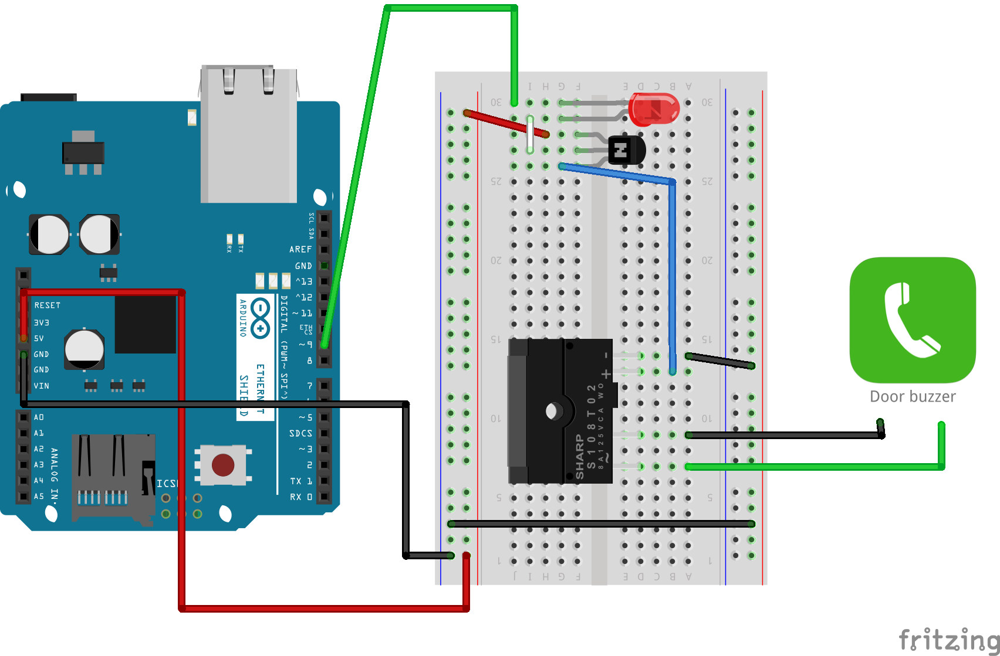

DoorDuino
===================
DoorDuino is an Arduino equipped with an [Ethernet Shield](http://arduino.cc/en/Main/ArduinoEthernetShield) that receives secured messages from a [Doorbot](https://github.com/lord/doorbot) server on the local intranet.  Hacker School uses this setup to open the door.

##Installation
To set up your DoorDuino microcontoller, you'll need the following:

+ an Arduino
+ an Arduino ethernet shield (alternatively, you might be able to use the Arduino Yún)
+ the Arduino sketch files (code), which includes:
    * A modified verison of the `Sha` library, included in this repo
    * The sketch `door_ethernet_server.ino` if you plan to use a hashed secure password to communicate with the Doorbot, or `door_ethernet_server_local.ino` if not
+ Your own `password.h` header file to define the secret password to be included only in the Arduino and on the Doorbot server.  The entirety of the file can be the single line `#define PASSWORD <your password here>`
+ Electronic components
    * Breadboard
    * Wires
    * Relay (Not included with Arduino)
    * Transistor (those that came with the Arduino will do)
    * Alligator clips (most likely)

The schematic of the circuit can be seen below:

